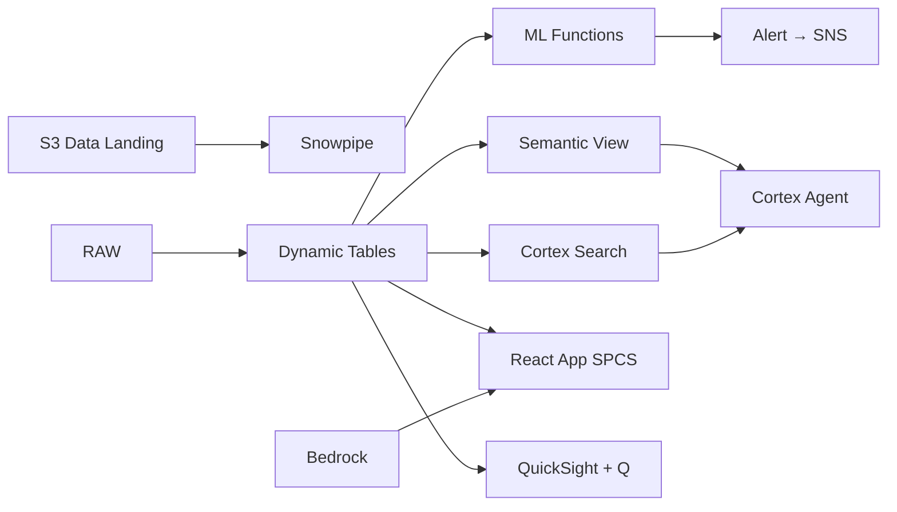

# Supplier Quality Management

AI-powered supplier quality management for 200+ tier-1 automotive suppliers — Textract parses audit reports, Cortex Search indexes quality standards, and AI_PARSE_DOCUMENT extracts non-conformance data across Thailand's automotive supply chain.

## Architecture

Thailand produces 1.88 million vehicles annually with 220+ tier-1 suppliers across the Eastern Seaboard. Manual audit tracking and paper-based compliance create blind spots — 14 suppliers are silently degrading in quality, generating ฿1.2B in annual Cost of Poor Quality that traditional scorecards detect months too late.



## Snowflake Capabilities

| Capability | Implementation |
|-----------|---------------|
| Dynamic Tables | SUPPLIER_RISK_SCORES / NCR_TRENDS / AUDIT_COMPLIANCE / COPQ_SUMMARY |
| ML Functions | ML.FORECAST + ML.ANOMALY_DETECTION |
| Cortex AI | AI_PARSE_DOCUMENT, AI_CLASSIFY, SUMMARIZE |
| Cortex Search | 150 documents indexed |
| Cortex Agent | SUPPLIER_QUALITY_AGENT |
| Semantic View | SUPPLIER_QUALITY_ANALYTICS |
| React App (SPCS) | 5 tabs + DemoGuide |


## AWS Services

| Service | Role in Demo |
|---------|-------------|
| Amazon Textract | Extract structured data from supplier audit PDFs (450 documents) |
| Amazon Comprehend | Classify non-conformance severity from text descriptions |
| Amazon Bedrock (Claude) | Generate supplier risk narratives and corrective action recommendations |
| Amazon S3 | Store supplier audit documents and quality records |
| Amazon SNS | Alert procurement team on high-risk supplier events |
| Amazon QuickSight + Q | Supplier quality dashboard with natural language queries |


## Personas

| Persona | Role | Key Questions |
|---------|------|---------------|
| **Prasert Thanapatpisal** | Head of Supplier Quality | "Which suppliers have the highest non-conformance rate?" "What's our total cost of poor quality this quarter?" |
| **Nattaya Siriphanich** | Quality Assurance Engineer | "What are the open CAPAs for supplier S-0047?" "Show me the PPAP status for the new brake caliper supplier." |


## Data

| Table | Rows | Description |
|-------|------|-------------|
| SUPPLIERS | 220 | Tier-1 and tier-2 automotive suppliers in Thailand |
| AUDIT_REPORTS | 450 | Supplier audit reports (PDF parsed via Textract/AI_PARSE_DOCUMENT) |
| NON_CONFORMANCES | 3,200 | Non-conformance records (NCRs) with severity and root cause |
| CORRECTIVE_ACTIONS | 2,800 | CAPA records linked to NCRs |
| QUALITY_STANDARDS | 150 | IATF 16949, Thai Industrial Standards, OEM-specific requirements |
| INCOMING_INSPECTION | 50,000 | Incoming material inspection results by lot |
| SUPPLIER_SCORECARDS | 2,640 | Monthly supplier performance scorecards (12 months × 220 suppliers) |
| THAI_AUTO_INDUSTRY | 10 | Thailand automotive industry context and export data |


## Build Instructions

### Prerequisites
- Snowflake account with ACCOUNTADMIN access
- Cortex AI enabled (ML Functions, Search, Agent)
- Warehouse: SUPPLIER_WH (Medium)
- AWS CLI with access (us-west-2)

### Deployment

```bash
snowsql -f snowflake/00_setup.sql
snowsql -f snowflake/01_marketplace_install.sql
snowsql -f snowflake/02_raw_tables.sql
snowsql -f snowflake/03_staging.sql
snowsql -f snowflake/04_dynamic_tables.sql
snowsql -f snowflake/05_search.sql
snowsql -f snowflake/06_ml_models.sql
snowsql -f snowflake/07_semantic_view.sql
snowsql -f snowflake/08_agent.sql
```

### React App (SPCS)
```bash
cd app && npm ci && npm run build
docker build -t aws-thailand-automotive-supplier-quality-app .
docker push bdiqc8sm-default.registry.snowflakecomputing.com/supplier_quality/app/aws_thailand_automotive_supplier_quality/app:latest
```

### Demo Mode
Open the app URL with `?demo=true` for presenter view.

## Build Modes

### Snowflake Only
Run scripts 00-08 (skip AWS-specific integration). Uses:
- **AI_PARSE_DOCUMENT (native)** instead of Amazon Textract
- **AI_CLASSIFY (native)** instead of Amazon Comprehend
- **Cortex Complete** instead of Amazon Bedrock (Claude)
- **Snowflake Stage + Cortex Search** instead of Amazon S3
- **Alerts + Notification Integration** instead of Amazon SNS
- **Snowflake Intelligence (Cortex Analyst)** instead of Amazon QuickSight + Q

### Full AWS + Snowflake
Run all scripts including AWS integration. Deploy QuickSight dashboard from `quicksight/`.

## Business Impact

Industry research and Snowflake customer outcomes:
- **Thailand produced 1.88 million vehicles in 2023, ranking 12th globally with ฿2.5T in exports** — [FTI Thailand](https://www.fti.or.th/eng/)
- **AI-powered supplier quality management reduces COPQ by 20-35% in automotive manufacturing** — [McKinsey Automotive](https://www.mckinsey.com/industries/automotive-and-assembly/our-insights)
- **Document AI processing reduces audit review time by 70%, catching 40% more non-conformances** — [Deloitte Digital](https://www2.deloitte.com/us/en/insights/industry/manufacturing/industry-4-0.html)
- **Toyota Thailand operates 500+ supplier quality audits annually across its Thai supply base** — [Toyota Thailand](https://www.toyota.co.th/en)


## Key Demo Numbers

- **฿1.2B** annual Cost of Poor Quality across 220 suppliers (US$34M)
- **14 suppliers** flagged HIGH RISK (score > 80)
- **23 audits** overdue by more than 30 days
- **450 PDFs** parsed by AI_PARSE_DOCUMENT into structured findings
- **3,200 NCRs** tracked with AI-classified severity
- **150 standards** indexed in Cortex Search for instant compliance lookup


## License

Apache 2.0 — See [LICENSE](LICENSE) for details.

This is a personal demo project and is not an official Snowflake offering. It comes with no support or warranty.